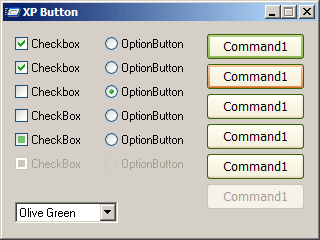



## XP Button

### Description

Subclassing standard VB Command Button, CheckBox, RadioButton for own paint with graphics from Windows XP
 
### More Info
 
Knownledge of subclassing

             |
---                |---
**Submitted On**   |2001-12-29 12:25:08
**By**             |[\`ïè’ =^\-^= \`ïè’](https://github.com/Planet-Source-Code/PSCIndex/blob/master/ByAuthor/empty.md)
**Level**          |Intermediate
**User Rating**    |3.0 (33 globes from 11 users)
**Compatibility**  |VB 6\.0
**Category**       |[Custom Controls/ Forms/  Menus](https://github.com/Planet-Source-Code/PSCIndex/blob/master/ByCategory/custom-controls-forms-menus__1-4.md)
**World**          |[Visual Basic](https://github.com/Planet-Source-Code/PSCIndex/blob/master/ByWorld/visual-basic.md)
**Archive File**   |[XP\_Button664153292002\.zip](https://github.com/Planet-Source-Code/xp-button__1-33179/archive/master.zip)

